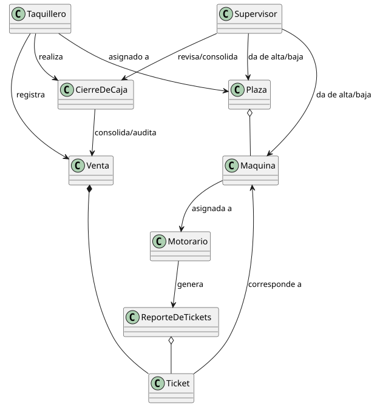

# Modelo del Dominio y Glosario de Términos

Este documento describe el modelo conceptual del dominio para el Sistema Gestionador de Tickets (pyTicketing). El modelo establece el vocabulario común y las relaciones fundamentales entre las entidades del negocio de ferias itinerantes, enfocándose en los conceptos esenciales de la generación y trazabilidad de tickets dentro de un parque de atracciones.

## Propósito
- Establecer un vocabulario común entre desarrolladores, supervisores y personal operativo.
- Definir las reglas de negocio para la emisión, validación y consolidación de ingresos.
- Servir como base conceptual para el diseño de la base de datos y casos de uso.

## Diagrama del Modelo del Dominio

> [Ver código fuente (PlantUML)](../../../UML/00-requisitos/00-modeloDelDominio/modelo-del-dominio.puml)

## Problema que resuelve
El sistema garantiza la **trazabilidad financiera y operativa** asegurando que:
1. **Venta válida:** Todo ticket emitido por un Taquillero pertenezca a una Venta registrada.
2. **Acceso único:** Cada ticket autorice el acceso a una única Máquina (atracción).
3. **Cuadre de caja:** La suma de Ventas individuales coincida exactamente con el Cierre de Caja del turno.

## 📖 Glosario de Términos

### Entidades y Roles

| Entidad / Rol | Tipo | Descripción |
| :--- | :--- | :--- |
| **Plaza** | Entidad | Ubicación geográfica temporal donde se instala el parque e itineran máquinas y personal. |
| **Máquina** | Entidad | Atracción física (ej. Noria, Coches de choque) con aforo y estado operativo. |
| **Venta** | Entidad | Registro de la transacción comercial realizada en caja que agrupa uno o varios tickets emitidos. |
| **Ticket** | Entidad | Comprobante que otorga el derecho de acceso a una atracción específica. |
| **Taquillero** | Rol | Personal responsable de la emisión de tickets y el arqueo de caja. |
| **Motorario** | Rol | Operador de máquina encargado del control de acceso y lectura del ticket. |
| **Supervisor** | Rol | Encargado de la logística, asignaciones y validación de cierres financieros. |

### Procesos Financieros y Operaciones

| Proceso / Operación | Tipo | Descripción |
| :--- | :--- | :--- |
| **Anulación de Venta** | Operación | Cancelación de una transacción realizada por el Taquillero durante su turno. Invalida los tickets asociados y revierte el importe en caja. |
| **Cierre de Caja** | Proceso | Consolidación diaria o por turno de todas las ventas realizadas, ejecutada por el Taquillero. |
| **Revisión de Caja** | Proceso | Verificación del Cierre de Caja ejecutada por el Supervisor contra los registros del sistema y el dinero físico recaudado. |
| **Reembolso** | Proceso | Devolución del importe de un ticket al cliente tras su emisión. Requiere **Autorización de Reembolso** por parte del Supervisor. |
| **Asignación** | Operación | Vinculación temporal de un recurso humano (Taquillero, Motorario) o material (Máquina) a una entidad operativa (Plaza). |

### Ciclo de Vida y Estados del Dominio

| Entidad | Estado | Descripción |
| :--- | :--- | :--- |
| **Máquina / Plaza** | **Alta / Activa** | La entidad está disponible e integrada en la operativa del parque para recibir o vender tickets. |
| **Máquina / Plaza** | **Baja / Inactiva** | Inactivación de la entidad (por mantenimiento o final de temporada) sin eliminar su historial contable o de uso. |
| **Ticket** | **Válido / Consumido / Anulado** | Representa la validez del acceso: listo para usar, ya validado por el Motorario, o cancelado comercialmente. |
| **Venta** | **Completada / Anulada / Reembolsada** | Refleja el estado contable final de la transacción económica en el sistema. |

## Relaciones del Modelo

### Relaciones Operativas y de Infraestructura
- **Plaza contiene Máquinas:** Una plaza física agrupa las atracciones disponibles en esa ubicación.
- **Motorario opera Máquina:** Asignación del personal responsable de validar la entrada.

### Relaciones Comerciales y de Servicio
- **Venta contiene Tickets:** Una transacción de compra genera uno o varios tickets individuales.
- **Ticket autoriza Máquina:** El ticket vincula el pago con el derecho de uso de una atracción específica.

### Relaciones Contables
- **Cierre de Caja consolida Ventas:** El resumen diario agrupa todas las ventas del turno.
- **Taquillero realiza Cierre de Caja:** Un taquillero es responsable de sus cierres de turno (asociación simple para mantener historial si el usuario cambia).

## Decisiones de Diseño y Semántica del Modelo

- **Agregación en lugar de Composición entre Taquillero y CierreDeCaja (`-->`):**
  * *Decisión:* Se utiliza una asociación simple en lugar de composición (`*-->`).
  * *Justificación:* Garantiza la integridad contable. Si un usuario `Taquillero` es dado de baja o eliminado, sus registros históricos de `CierreDeCaja` permanecen intactos para auditorías.
- **Independencia del Ticket respecto a la Máquina:**
  * *Decisión:* El `Ticket` nace de una `Venta` y referencia a una `Maquina`.
  * *Justificación:* Separa el evento financiero (cobro) de la prestación del servicio (uso de la atracción).