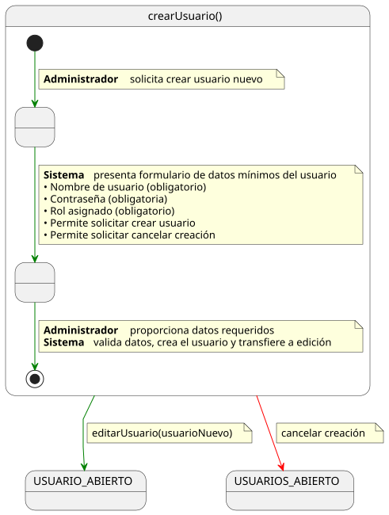
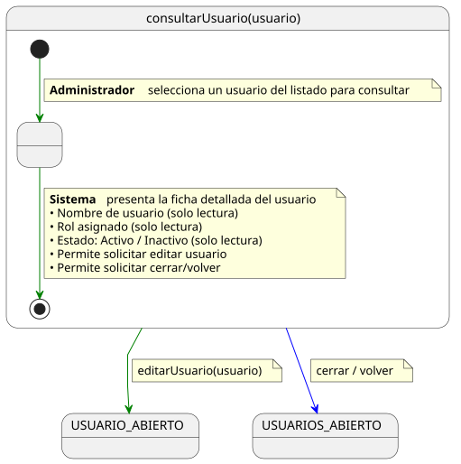
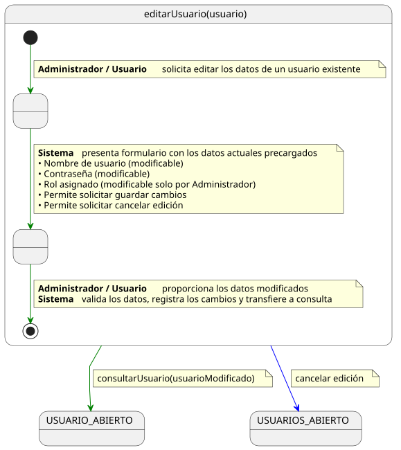
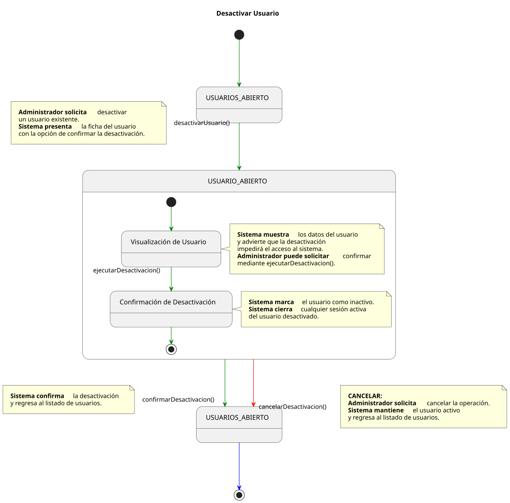
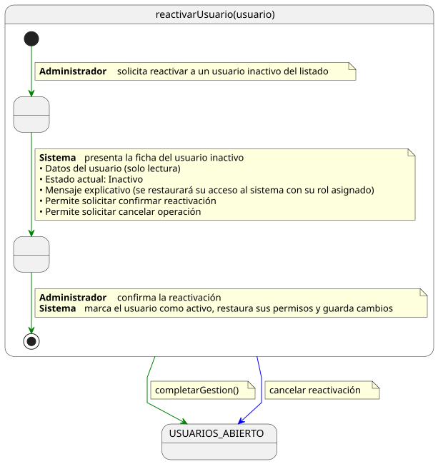

# Casos de Uso: Administrador

Este documento detalla los flujos de los casos de uso para el actor **Administrador**.

---

## Crear Usuario

[Ver código fuente (PlantUML)](../../../../../UML/00-requisitos/01-actores-casosDeUso/01-casosDeUso/Administrador/crearUsuario.puml)

---

## Consultar Usuario

[Ver código fuente (PlantUML)](../../../../../UML/00-requisitos/01-actores-casosDeUso/01-casosDeUso/Administrador/consultarUsuario.puml)

---

## Editar Usuario

[Ver código fuente (PlantUML)](../../../../../UML/00-requisitos/01-actores-casosDeUso/01-casosDeUso/Administrador/editarUsuario.puml)

---

## Desactivar Usuario

[Ver código fuente (PlantUML)](../../../../../UML/00-requisitos/01-actores-casosDeUso/01-casosDeUso/Administrador/desactivarUsuario.puml)

---

## Reactivar Usuario

[Ver código fuente (PlantUML)](../../../../../UML/00-requisitos/01-actores-casosDeUso/01-casosDeUso/Administrador/reactivarUsuario.puml)
