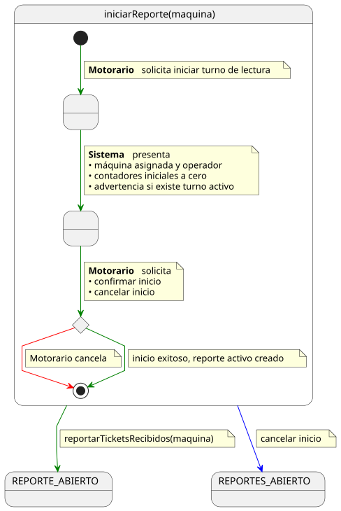
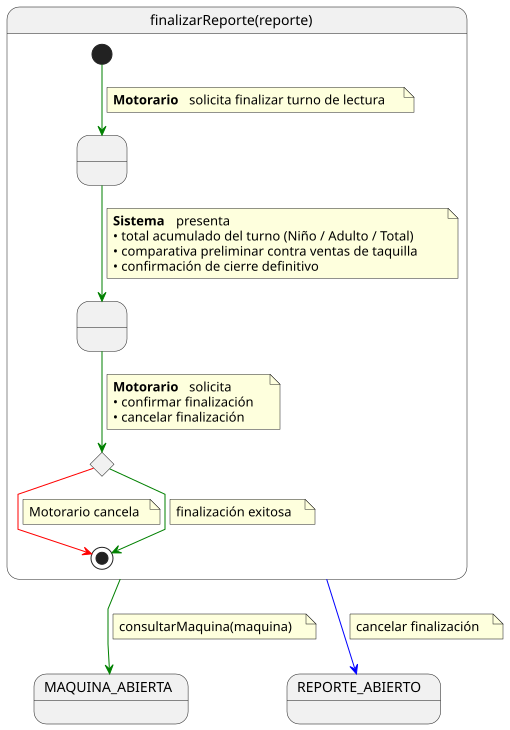

# Casos de Uso: Motorario

Este documento detalla los flujos de los casos de uso para el actor **Motorario**.

---

## Iniciar Reporte
  
[Ver código fuente (PlantUML)](../../../../../UML/00-requisitos/01-actores-casosDeUso/01-casosDeUso/Motorario/iniciarReporte.puml)

---

## Reportar Tickets Recibidos
  
[Ver código fuente (PlantUML)](../../../../../UML/00-requisitos/01-actores-casosDeUso/01-casosDeUso/Motorario/reportarTicketsRecibidos.puml)

---

## Finalizar Reporte
  
[Ver código fuente (PlantUML)](../../../../../UML/00-requisitos/01-actores-casosDeUso/01-casosDeUso/Motorario/finalizarReporte.puml)