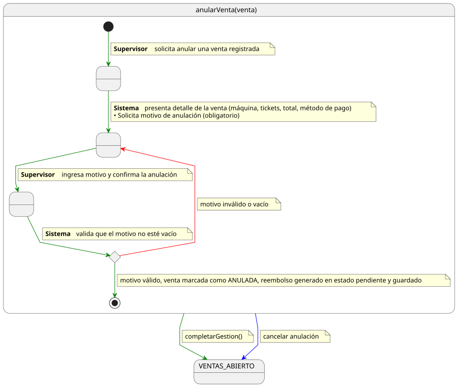
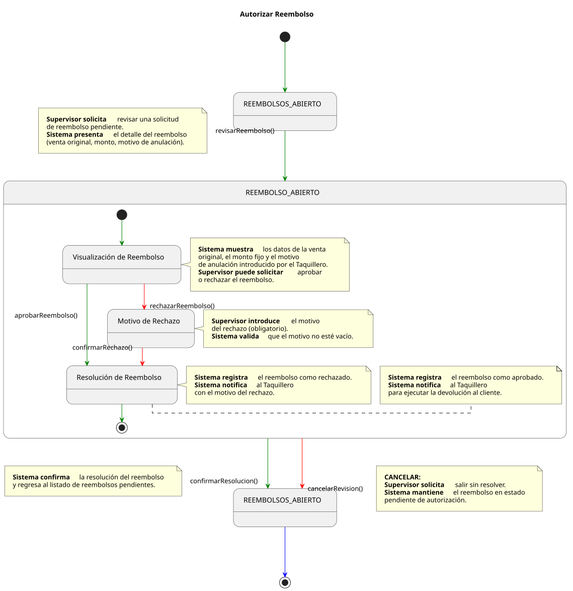
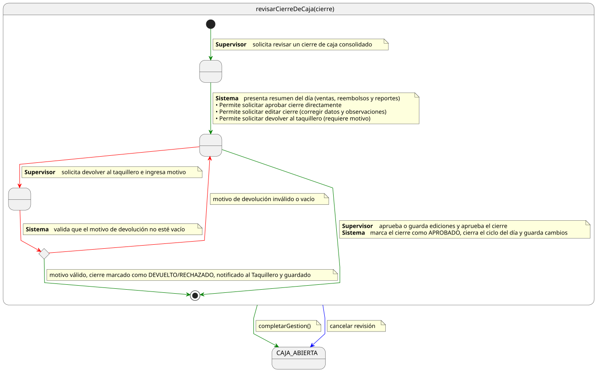

# Casos de Uso: Supervisor — Ventas

Este documento detalla los flujos de los casos de uso para la gestión de **Ventas** por parte del **Supervisor**.

---

## Anular Venta

[Ver código fuente (PlantUML)](../../../../../../UML/00-requisitos/01-actores-casosDeUso/01-casosDeUso/Supervisor/Venta/anularVenta.puml)

---

## Autorizar Reembolso

[Ver código fuente (PlantUML)](../../../../../../UML/00-requisitos/01-actores-casosDeUso/01-casosDeUso/Supervisor/Venta/autorizarReembolso.puml)

---

## Revisar Cierre de Caja

[Ver código fuente (PlantUML)](../../../../../../UML/00-requisitos/01-actores-casosDeUso/01-casosDeUso/Supervisor/Venta/revisarCierreDeCaja.puml)
