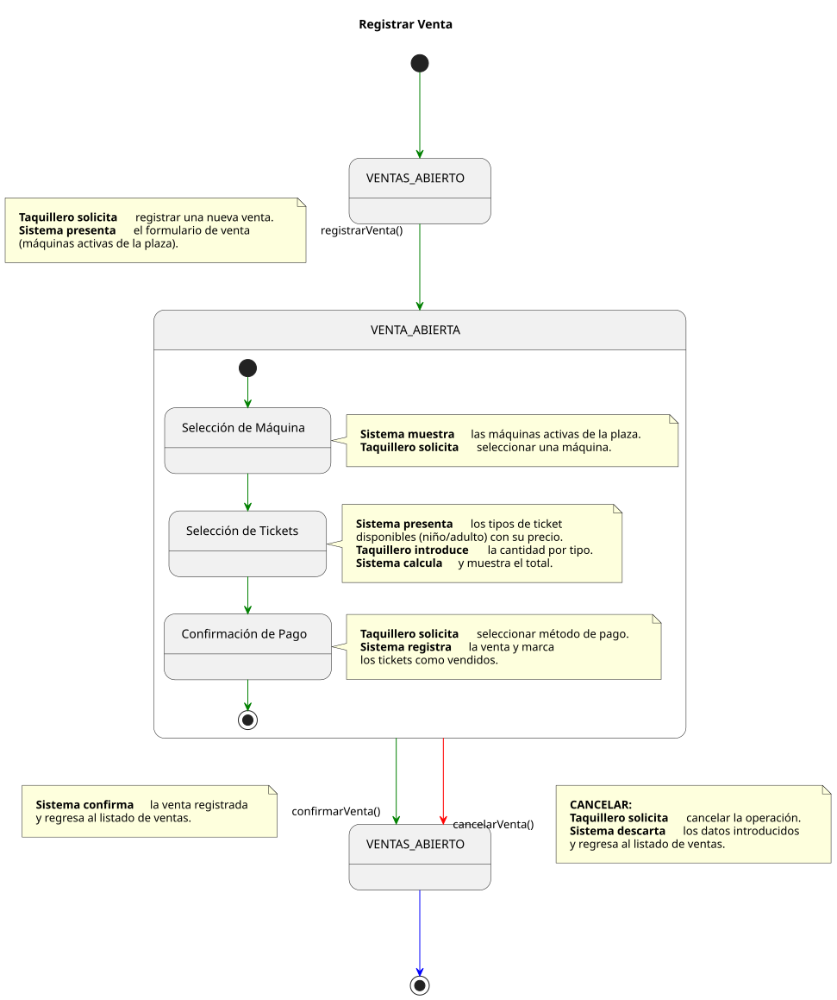
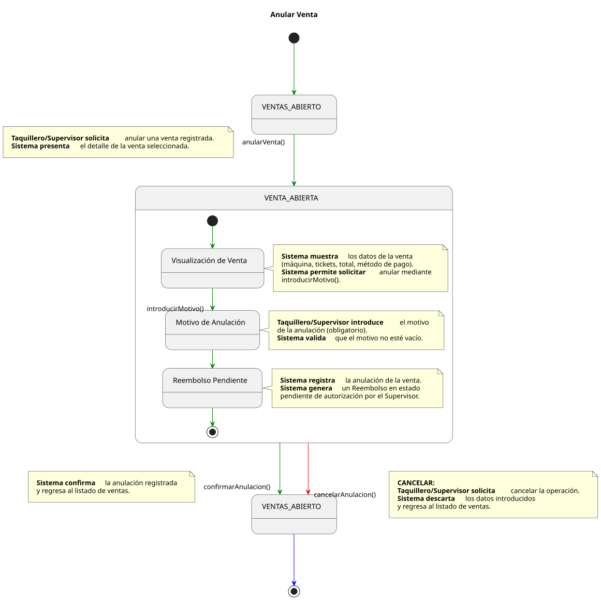
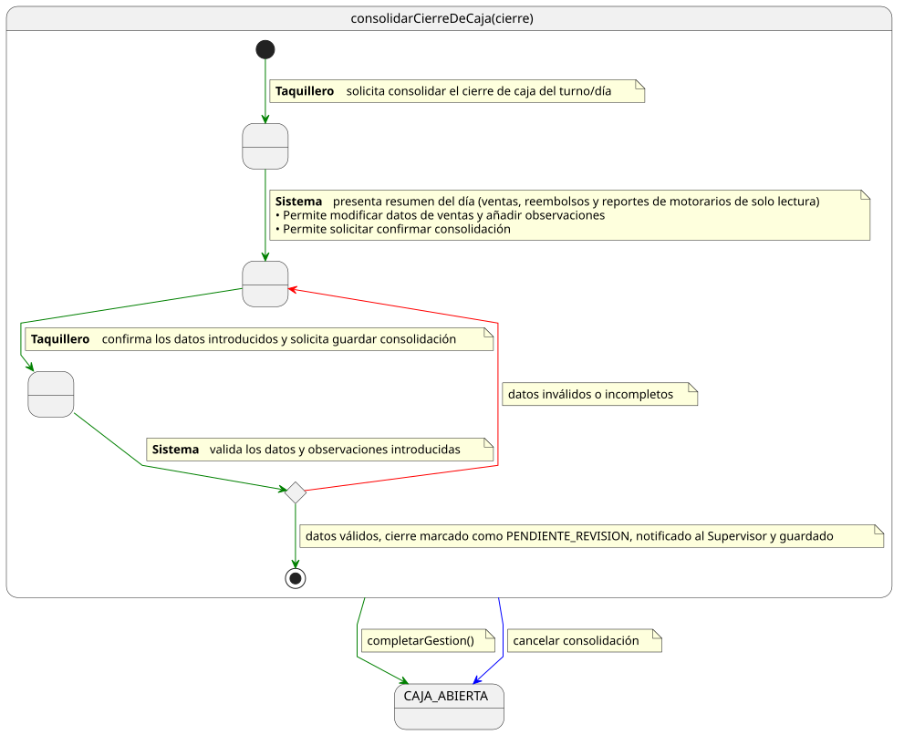

# Casos de Uso: Taquillero

Este documento detalla los flujos de los casos de uso para el actor **Taquillero**.

---

## Registrar Venta

[Ver código fuente (PlantUML)](../../../../../UML/00-requisitos/01-actores-casosDeUso/01-casosDeUso/Taquillero/registrarVenta.puml)

---

## Anular Venta

[Ver código fuente (PlantUML)](../../../../../UML/00-requisitos/01-actores-casosDeUso/01-casosDeUso/Taquillero/anularVenta.puml)

---

## Consolidar Cierre de Caja

[Ver código fuente (PlantUML)](../../../../../UML/00-requisitos/01-actores-casosDeUso/01-casosDeUso/Taquillero/consolidarCierreDeCaja.puml)
