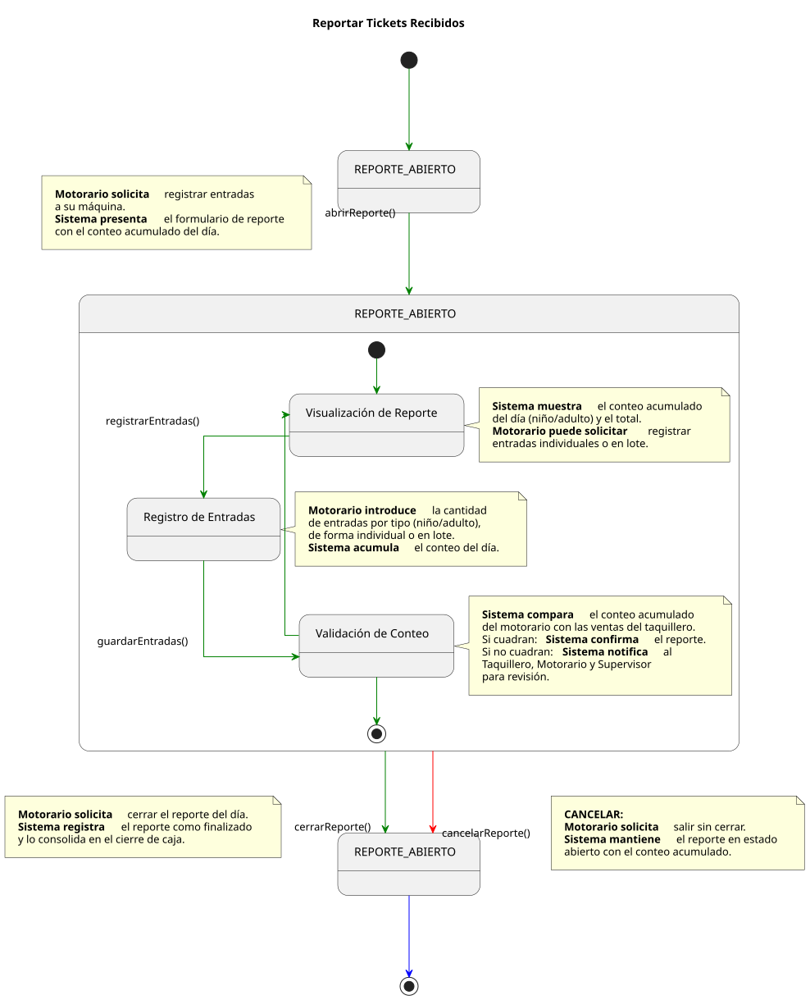

# Casos de Uso: Motorario

Este documento detalla los flujos de los casos de uso para el actor **Motorario**.

---

## Reportar Tickets Recibidos

[Ver código fuente (PlantUML)](../../../../../UML/00-requisitos/01-actores_casosDeUso/01-casosDeUso/Motorario/reportarTicketsRecibidos.puml)
