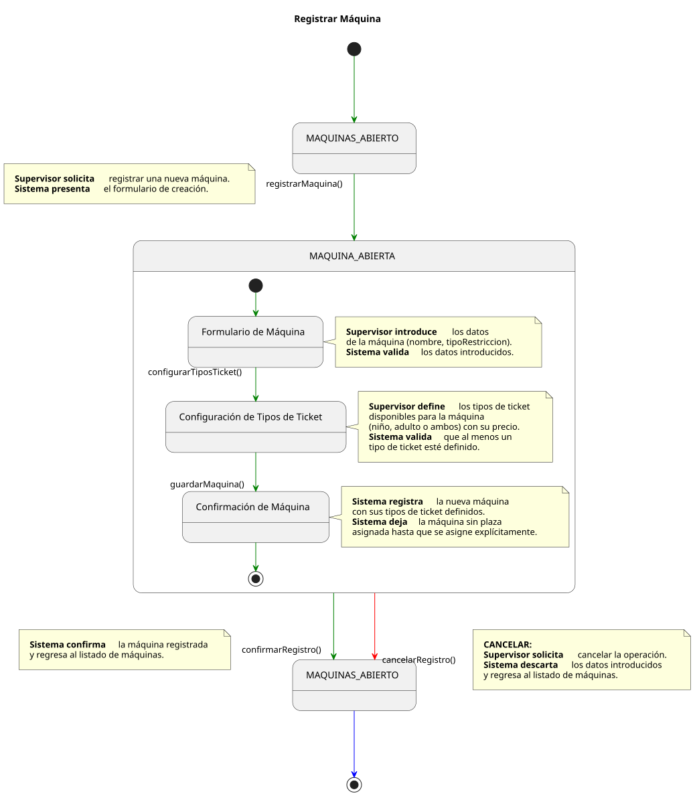
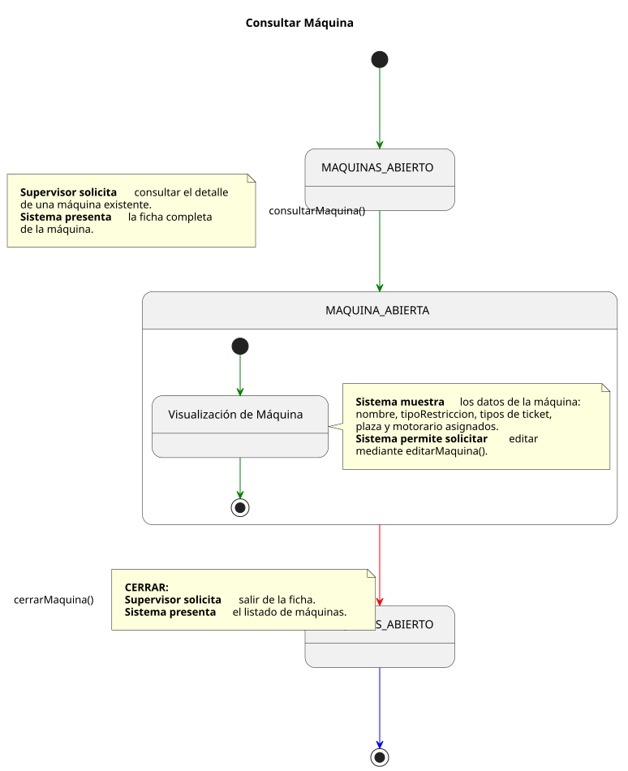
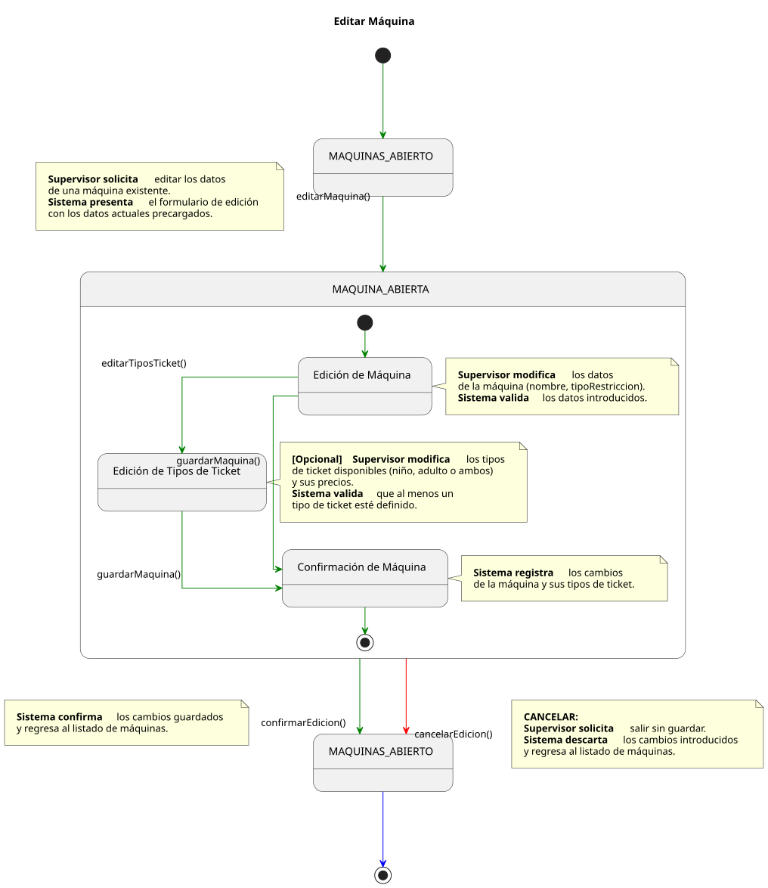
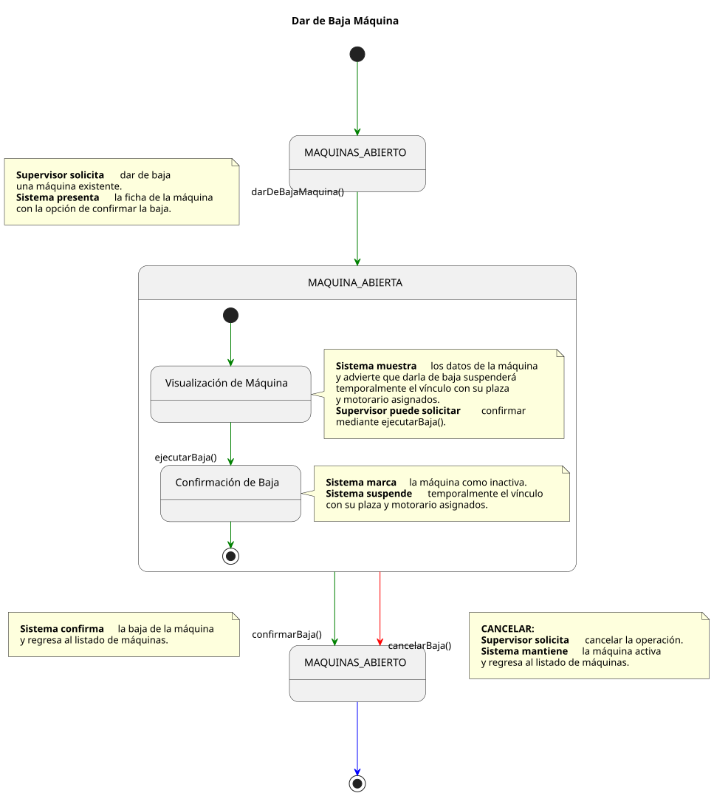
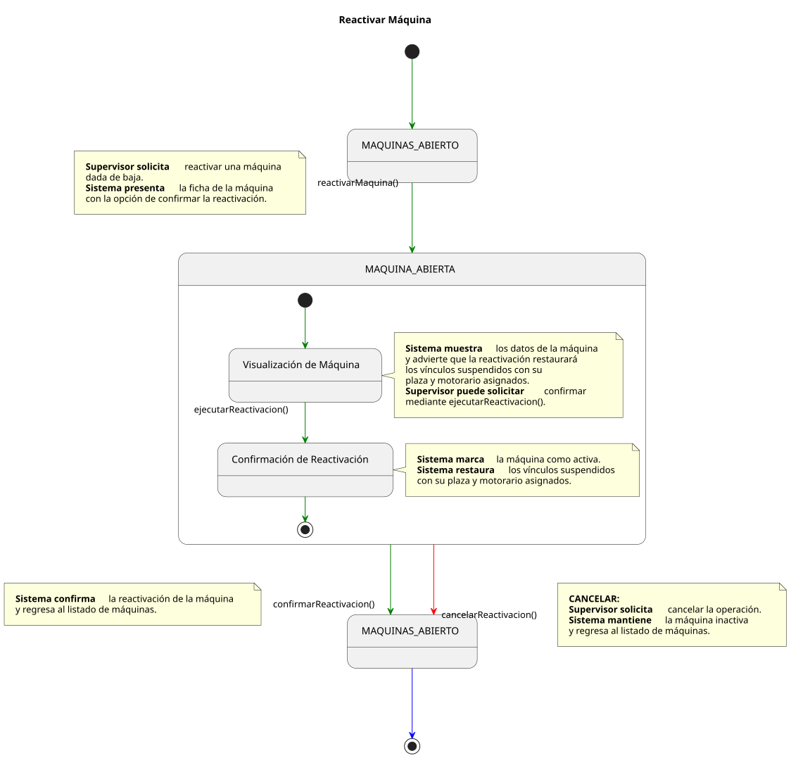
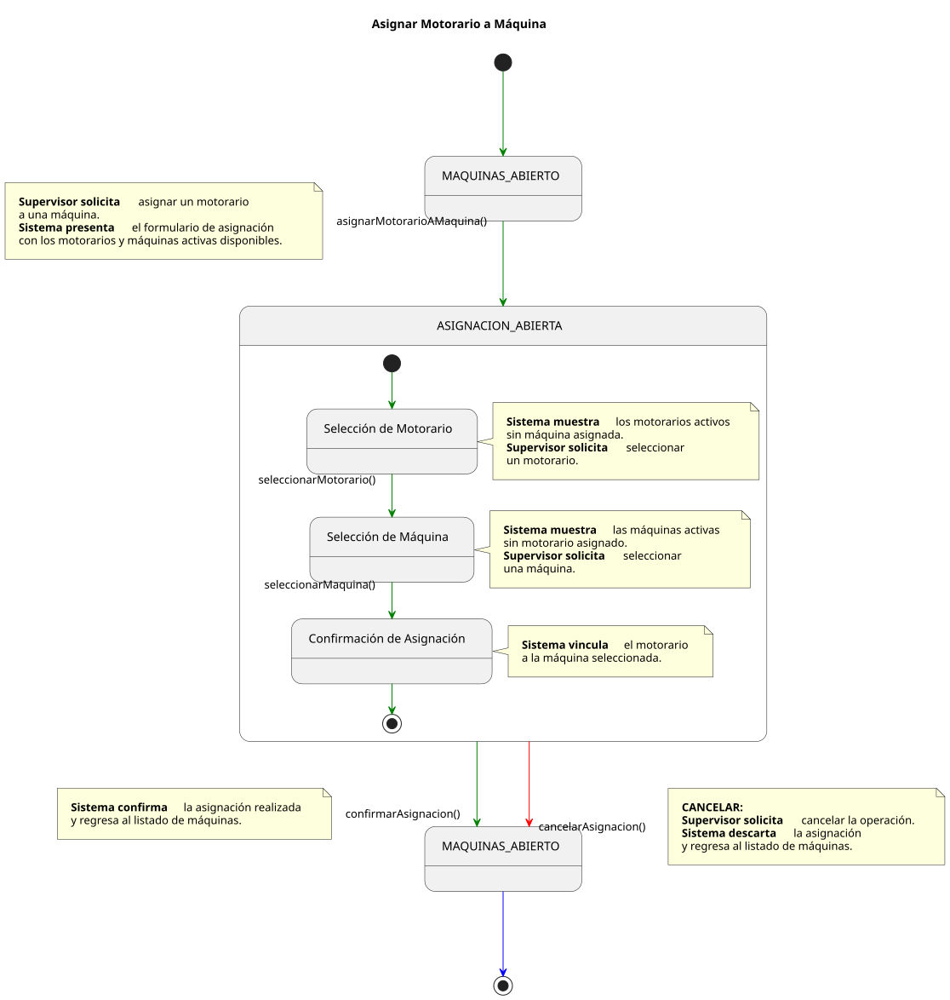
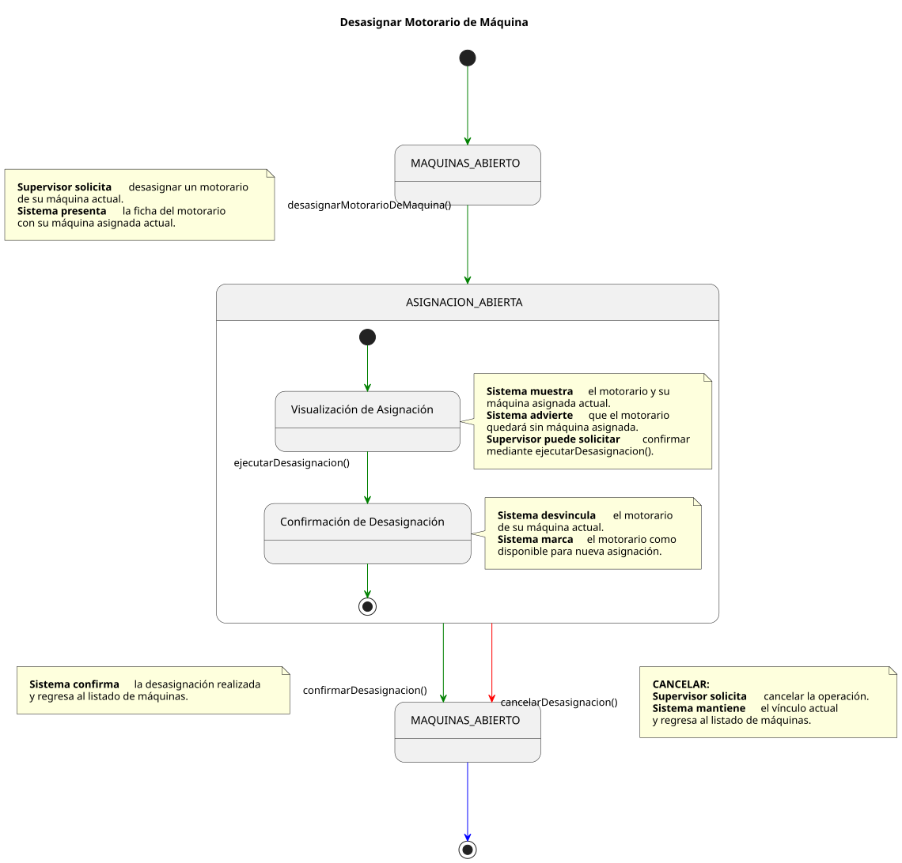

# Casos de Uso: Supervisor — Máquinas

Este documento detalla los flujos de los casos de uso para la gestión de **Máquinas** por parte del **Supervisor**.

---

## Registrar Máquina

[Ver código fuente (PlantUML)](../../../../../../UML/00-requisitos/01-actores_casosDeUso/01-casosDeUso/Supervisor/Maquina/registrarMaquina.puml)

---

## Consultar Máquina

[Ver código fuente (PlantUML)](../../../../../../UML/00-requisitos/01-actores_casosDeUso/01-casosDeUso/Supervisor/Maquina/consultarMaquina.puml)

---

## Editar Máquina

[Ver código fuente (PlantUML)](../../../../../../UML/00-requisitos/01-actores_casosDeUso/01-casosDeUso/Supervisor/Maquina/editarMaquina.puml)

---

## Dar de Baja Máquina

[Ver código fuente (PlantUML)](../../../../../../UML/00-requisitos/01-actores_casosDeUso/01-casosDeUso/Supervisor/Maquina/darDeBajaMaquina.puml)

---

## Reactivar Máquina

[Ver código fuente (PlantUML)](../../../../../../UML/00-requisitos/01-actores_casosDeUso/01-casosDeUso/Supervisor/Maquina/reactivarMaquina.puml)

---

## Asignar Motorario a Máquina

[Ver código fuente (PlantUML)](../../../../../../UML/00-requisitos/01-actores_casosDeUso/01-casosDeUso/Supervisor/Maquina/asignarMotorarioAMaquina.puml)

---

## Desasignar Motorario de Máquina

[Ver código fuente (PlantUML)](../../../../../../UML/00-requisitos/01-actores_casosDeUso/01-casosDeUso/Supervisor/Maquina/desasignarMotorarioDeMaquina.puml)
