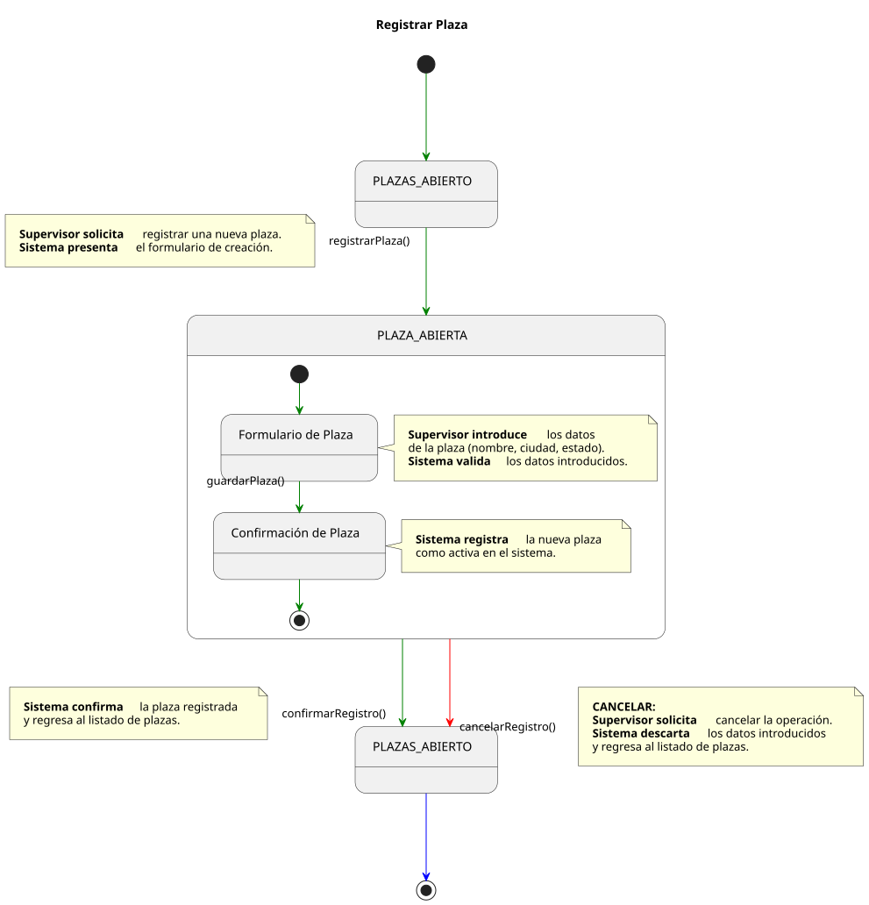
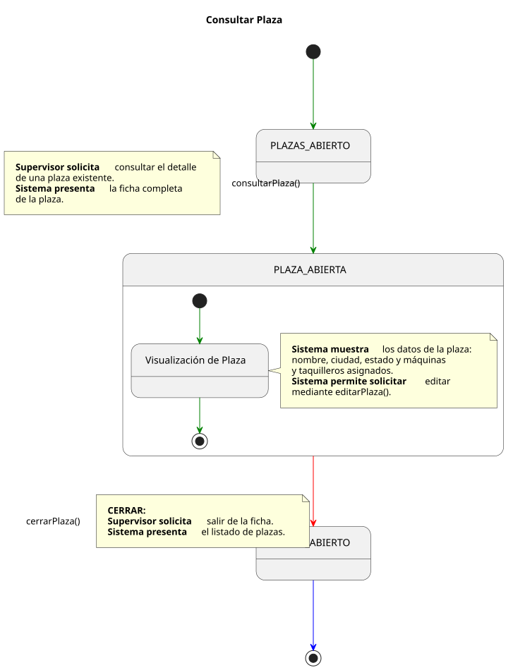
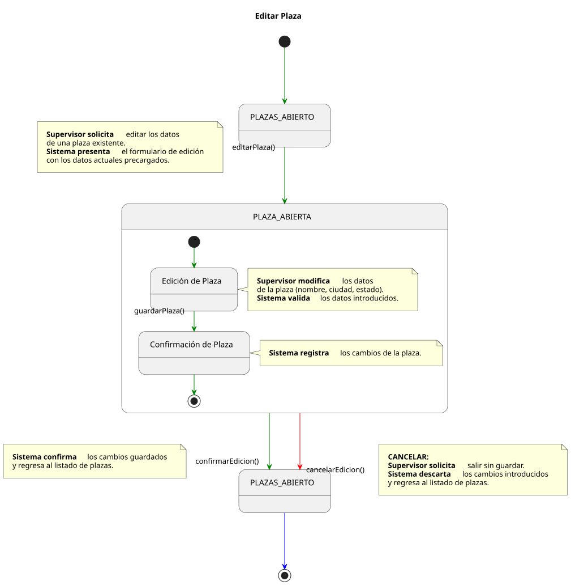
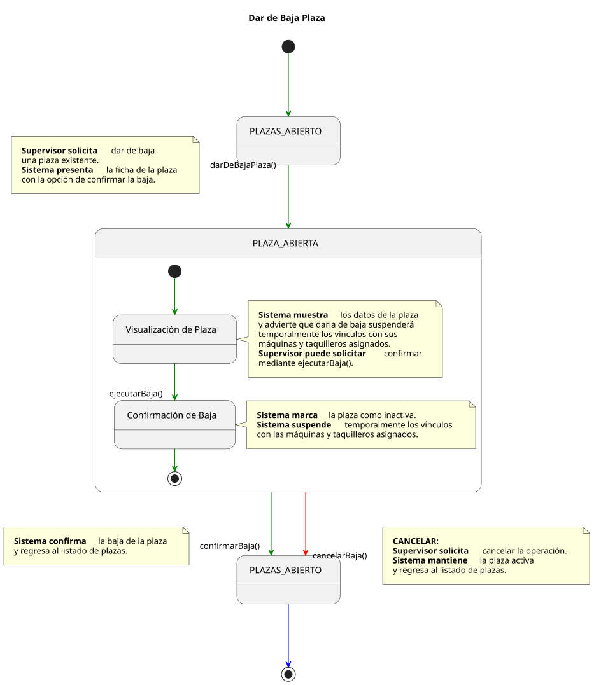
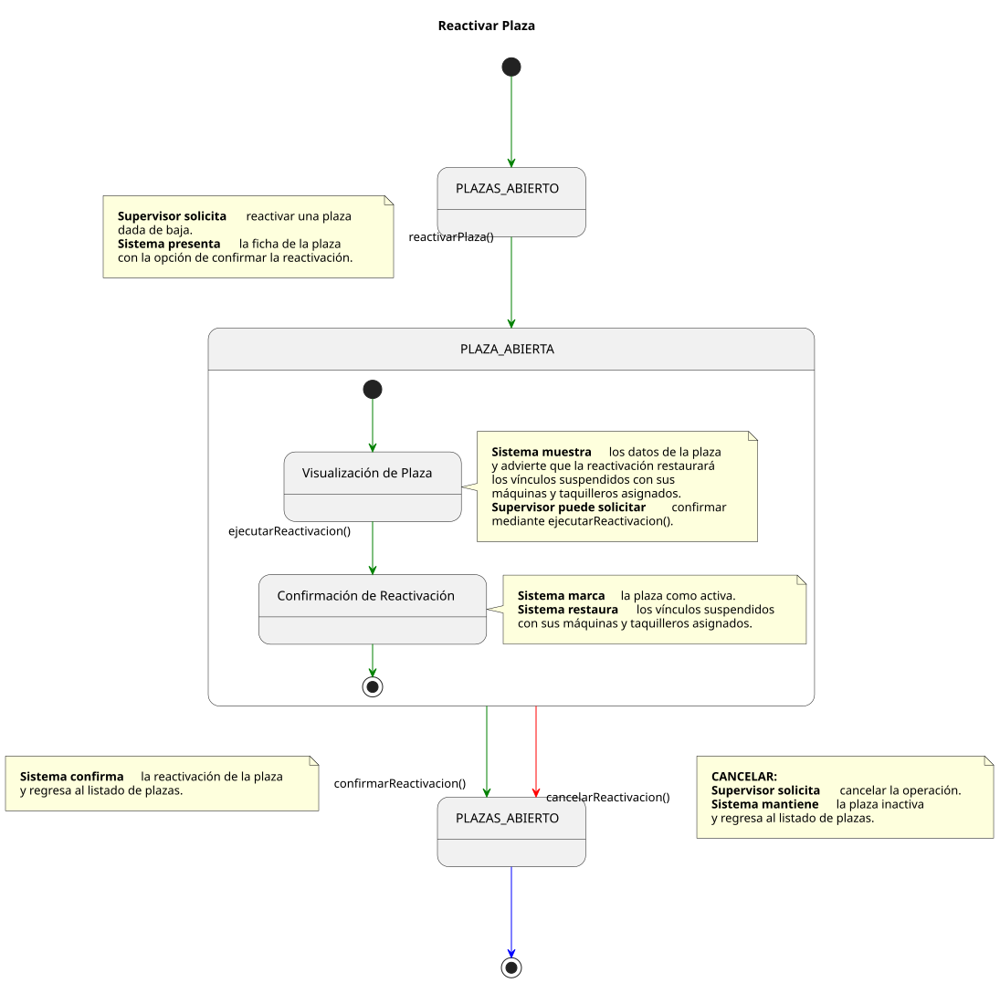
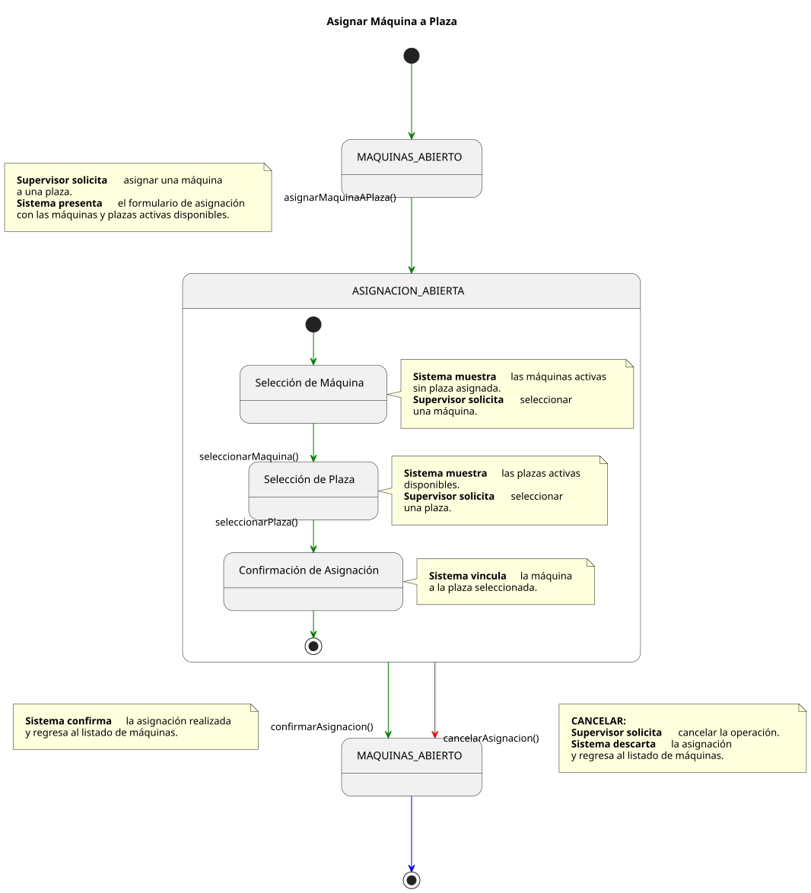
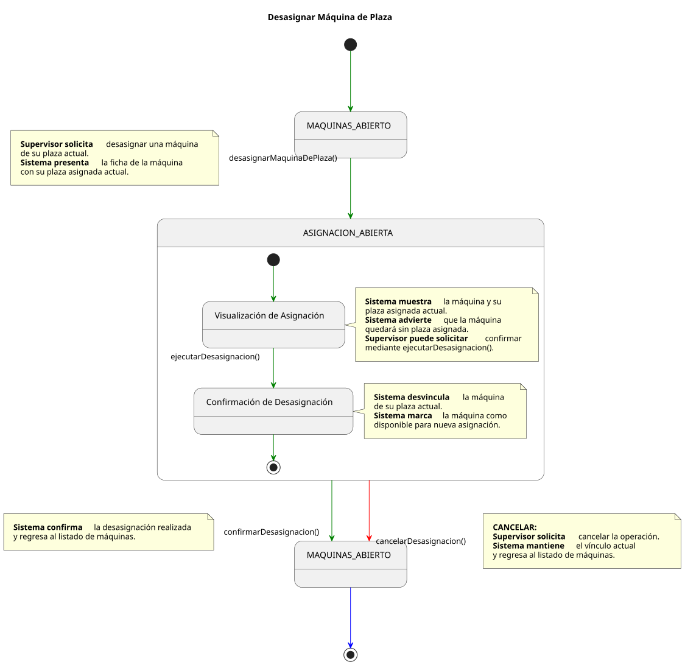
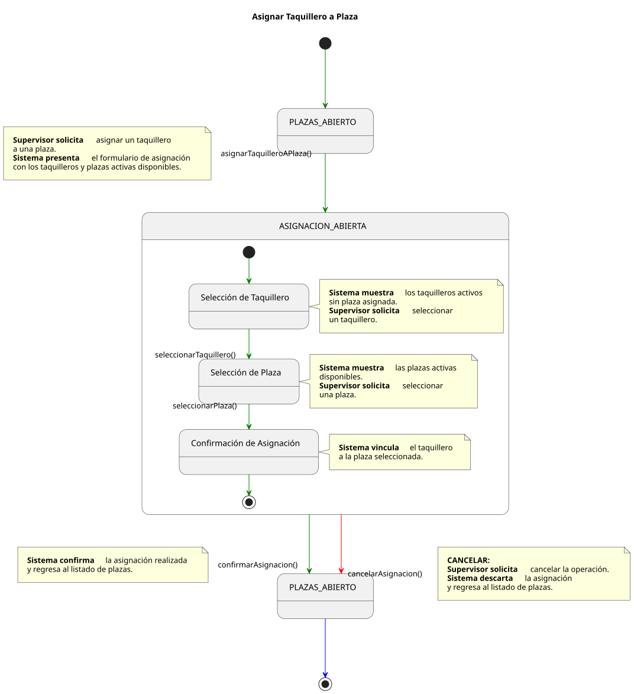
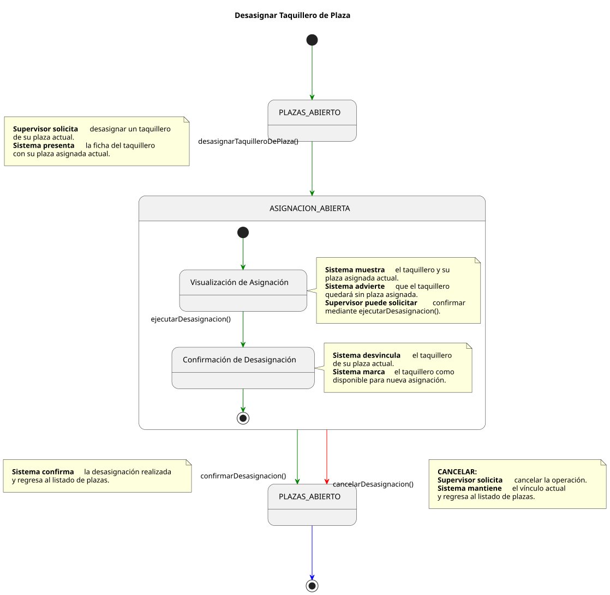

# Casos de Uso: Supervisor — Plazas

Este documento detalla los flujos de los casos de uso para la gestión de **Plazas** por parte del **Supervisor**.

---

## Registrar Plaza

[Ver código fuente (PlantUML)](../../../../../../UML/00-requisitos/01-actores_casosDeUso/01-casosDeUso/Supervisor/Plaza/registrarPlaza.puml)

---

## Consultar Plaza

[Ver código fuente (PlantUML)](../../../../../../UML/00-requisitos/01-actores_casosDeUso/01-casosDeUso/Supervisor/Plaza/consultarPlaza.puml)

---

## Editar Plaza

[Ver código fuente (PlantUML)](../../../../../../UML/00-requisitos/01-actores_casosDeUso/01-casosDeUso/Supervisor/Plaza/editarPlaza.puml)

---

## Dar de Baja Plaza

[Ver código fuente (PlantUML)](../../../../../../UML/00-requisitos/01-actores_casosDeUso/01-casosDeUso/Supervisor/Plaza/darDeBajaPlaza.puml)

---

## Reactivar Plaza

[Ver código fuente (PlantUML)](../../../../../../UML/00-requisitos/01-actores_casosDeUso/01-casosDeUso/Supervisor/Plaza/reactivarPlaza.puml)

---

## Asignar Máquina a Plaza

[Ver código fuente (PlantUML)](../../../../../../UML/00-requisitos/01-actores_casosDeUso/01-casosDeUso/Supervisor/Plaza/asignarMaquinaAPlaza.puml)

---

## Desasignar Máquina de Plaza

[Ver código fuente (PlantUML)](../../../../../../UML/00-requisitos/01-actores_casosDeUso/01-casosDeUso/Supervisor/Plaza/desasignarMaquinaDePlaza.puml)

---

## Asignar Taquillero a Plaza

[Ver código fuente (PlantUML)](../../../../../../UML/00-requisitos/01-actores_casosDeUso/01-casosDeUso/Supervisor/Plaza/asignarTaquilleroAPlaza.puml)

---

## Desasignar Taquillero de Plaza

[Ver código fuente (PlantUML)](../../../../../../UML/00-requisitos/01-actores_casosDeUso/01-casosDeUso/Supervisor/Plaza/desasignarTaquilleroDePlaza.puml)
